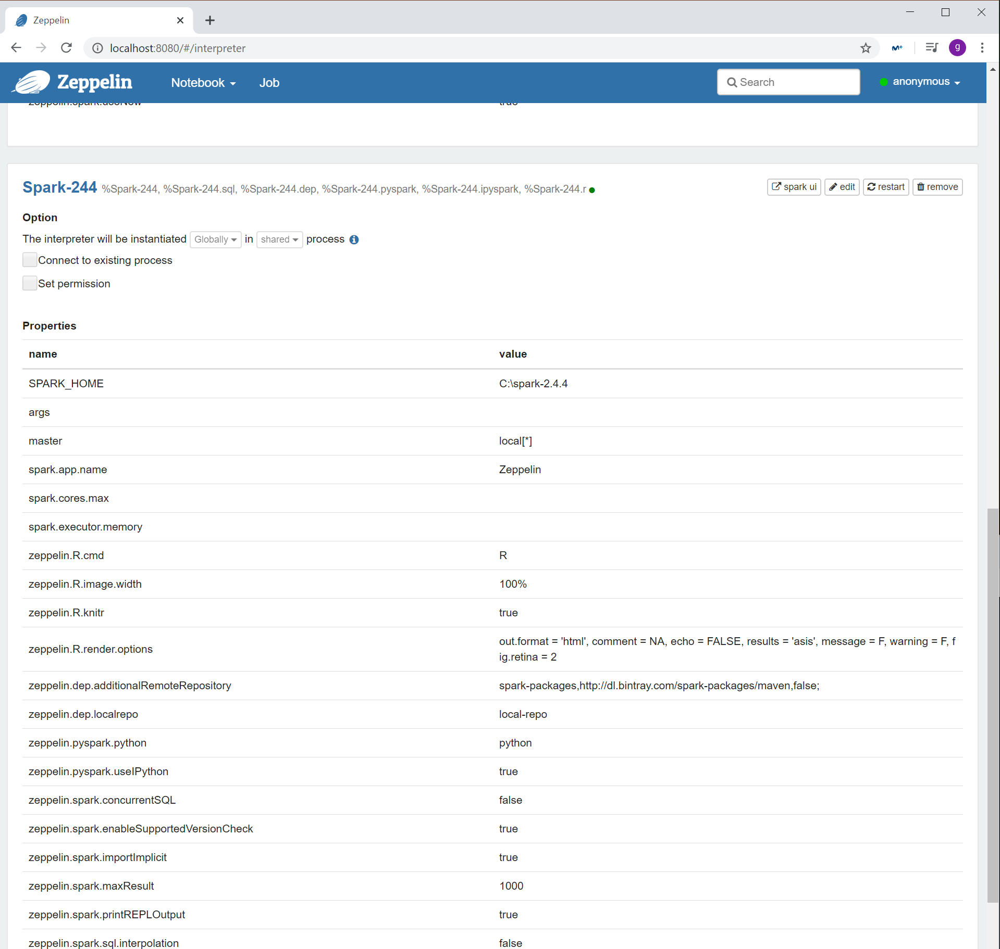

# Instalación de Zeppelin

### 1.- Descargamos zeppelin desde zeppelin.apache.org

### 2.- Contenido de la carpeta zeppelin

### 3.- Ejecutamos por consola, desde el directorio principal de zeppelin el siguiente comando 

### 4.-Este proceso ha levantado un servidor web local y el puerto que usa es 8080

# Conectar Spark con entorno Zeppelin

### 1.- Creamos un interprete:

### 2.- Una vez creado el interprete le indicamos la ruta donde tenemos instalado Spark.2.4.4

